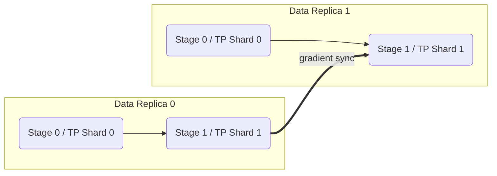

# Distributed Training

PySML ships with a lightweight distributed runtime that mirrors the ergonomics
of popular frameworks while keeping optional dependencies truly optional.
Collective communication is exposed via the :mod:`pysml.distributed`
package which automatically selects an appropriate backend (Gloo for CPU,
NCCL for CUDA, oneCCL for Intel XPU) and gracefully falls back to local
execution when the required libraries are missing.

## Environment Driven Initialisation

The runtime inspects common launch environment variables when the first tensor
queries its communicator. When variables such as ``WORLD_SIZE`` or ``RANK`` are
present, the process group is initialised automatically using the backend that
best matches the visible hardware:

```bash
# Single node example using torchrun style environment variables
export WORLD_SIZE=4
export RANK=0
export LOCAL_RANK=0
python train.py
```

If the environment indicates a single process (``WORLD_SIZE=1`` or unset) the
runtime configures an in-process ``dummy`` backend that keeps the code path
identical without incurring any network overhead. Advanced users can force a
specific backend via ``PYSML_DIST_BACKEND`` or steer the heuristic with
``PYSML_DIST_DEVICE``.

## Single Node, Multi-GPU

1. Launch one worker per GPU. ``torchrun`` and ``mpirun`` both work; PySML only
   requires the standard ``RANK``/``WORLD_SIZE`` variables to be set.
2. Ensure CUDA devices are visible (``CUDA_VISIBLE_DEVICES``) and leave
   ``PYSML_DIST_BACKEND`` unset so the runtime automatically selects NCCL.
3. Inside your training script call collective helpers directly on PySML
   tensors:

```python
from pysml.distributed import all_reduce
...
loss = loss_tensor.communicator.all_reduce(loss_tensor)
```

All tensors created on CUDA devices route to the NCCL communicator. CPU tensors
continue to use the Gloo fallback which is useful for host side coordination.

## Multi-Node Clusters

For multi-node deployments supply an explicit initialisation method
(e.g. ``tcp://host:port``) or use your cluster launcher of choice. Set
``PYSML_INIT_METHOD`` to the rendezvous endpoint to avoid duplicating
configuration in every script. Example using two nodes with four GPUs each:

```bash
# On the head node
export WORLD_SIZE=8
export RANK=0
export MASTER_ADDR=10.0.0.5
export MASTER_PORT=29500
export PYSML_INIT_METHOD=tcp://10.0.0.5:29500
python train.py
```

Subsequent ranks should update ``RANK`` (and ``LOCAL_RANK`` if desired) while
sharing the same rendezvous URL. The process group bootstrap reuses the
configuration and selects NCCL/oneCCL/Gloo depending on the device reported by
individual tensors.

## Manual Control

Developers who prefer explicit control can bypass the automatic initialisation
and call :func:`pysml.distributed.init_process_group` manually. The returned
communicator object exposes ``rank`` and ``world_size`` properties alongside
standard collective operations. Calling :func:`pysml.distributed.shutdown`
resets the state so the process can join a new job safely.

Refer to :mod:`pysml.distributed.collectives` for thin wrappers around
``all_reduce``, ``broadcast``, ``all_gather`` and ``reduce_scatter`` that follow
PySML's tensor semantics.

### Fault Tolerance & Timeouts

Collectives now honour the ``PYSML_COLLECTIVE_TIMEOUT`` and
``PYSML_COLLECTIVE_RETRIES`` environment variables. Wrappers such as
``pysml.distributed.all_reduce`` guard each operation with a configurable
deadline and retry loop. When a timeout or failure occurs a
``CollectiveOperationError`` is raised and subsequent collectives abort early to
prevent additional deadlocks. This behaviour provides clear diagnostics for
stalled ranks and keeps the remaining workers from hanging indefinitely.

### Monitoring & Metrics Hooks

Use :class:`pysml.distributed.DistributedMonitor` to collect throughput and loss
metrics without sprinkling conditional ``if rank == 0`` checks through the
training loop. The monitor supports context-managed batch timing, periodic
reports, and callback hooks to integrate progress bars or experiment trackers.
All metrics are aggregated with ``all_reduce`` so every log line represents the
global view across ranks.

```python
from pysml.distributed import DistributedMonitor

monitor = DistributedMonitor(total_steps=len(train_loader), log_every=20)
for batch, target in train_loader:
    loss = step(batch, target)
    monitor.update(batch_size=len(batch), loss=float(loss))
monitor.flush()  # final summary
```

### Distributed Checkpointing

:mod:`pysml.distributed.checkpointing` exposes ``save_rank_checkpoint`` and
``load_rank_checkpoint`` helpers that persist one shard per rank along with a
``manifest.json`` describing the layout. The manifest enables elastic restarts
– when the world size changes the loader maps new ranks onto the saved shards
round-robin. Combine the helper with ``tensor_parallel_shard_state_dict`` to
persist only the tensor-parallel slice owned by each worker.

### Debugging Multi-Process Runs

The :mod:`pysml.distributed.debugging` module adds two frequently requested
tools:

* ``launch_rank_repl`` opens an interactive console whose namespace already
  contains ``rank`` and ``world_size`` so you can introspect local tensors
  without leaving the running job.
* ``register_gradient_anomaly_detector`` instruments a module with post-backward
  hooks that flag NaNs, infinities, or exploding gradients. You can supply a
  custom callback (for logging or paging) or rely on the default exception.

These hooks are rank-local which makes them safe to enable even on large jobs –
each worker only inspects its own gradients and reports anomalies with its rank
ID for quick triage.

## Composite Parallel Strategies

PySML exposes a :class:`~pysml.distributed.ParallelStrategy` helper to describe
how a model should be sharded across data, pipeline, and tensor parallel
dimensions. The object keeps the configuration in a single place, validates it
against the detected ``WORLD_SIZE``, and provides convenience constructors:

```python
from pysml.distributed import ParallelStrategy

# Single convenience axis
dp = ParallelStrategy.data(degree=4)
tp = ParallelStrategy.tensor(degree=2, mode="2d", dims=(2, 1))
pp = ParallelStrategy.pipeline(stages=3, schedule="1f1b", chunks=4)

# Mixed configuration with checkpointed pipeline activations
hybrid = ParallelStrategy.hybrid(
    data=2,
    pipeline=4,
    tensor=2,
    schedule="1f1b",
    chunks=2,
    activation_checkpoint=True,
)
```

Calling :meth:`ParallelStrategy.apply` performs the wrapping order automatically
(tensor parallel initialisation, followed by pipeline partitioning, then DDP
replicas):

```python
model = TinyTransformerClassifier()
strategy = ParallelStrategy.hybrid(data=2, pipeline=4, tensor=2)
model = strategy.apply(model, pipeline_stages=custom_stages)
```

When ``pipeline_parallel`` exceeds ``1`` you must provide ``pipeline_stages`` –
a list of :class:`~pysml.nn.Module` objects that represent each stage. PySML does
not yet infer cross-rank partitions automatically. Tensor-parallel helpers are
activated transparently via :func:`pysml.distributed.tensor_parallel.init_tensor_parallel`.



### Validation & Failure Modes

``ParallelStrategy.validate()`` inspects the current process group and raises
clear exceptions when a request cannot be fulfilled:

| Symptom | Explanation | Fix |
| --- | --- | --- |
| ``tensor_parallel=4`` with ``WORLD_SIZE=2`` | Not enough ranks to host the requested tensor shards. | Launch more processes or reduce the tensor degree. |
| ``pipeline_parallel>1`` without ``pipeline_stages`` | PySML cannot infer stage boundaries. | Pass an explicit list of stages to ``apply()``. |
| ``data_parallel>1`` but ``WORLD_SIZE=1`` | DDP needs multiple processes. | Use ``torchrun``/``mpirun`` or lower the data parallel degree. |

If the runtime runs on a single process the validation relaxes the relationship
between pipeline degree and world size so you can prototype pipelined models on
one device before scaling out.

## Scaling & Resource Utilisation Best Practices

* Prefer smaller ``log_every`` values in :class:`DistributedMonitor` when
  experimenting; bump the interval for production runs to reduce log volume.
* Set ``PYSML_COLLECTIVE_TIMEOUT`` to a value slightly higher than your longest
  expected batch duration to automatically flag deadlocks.
* When checkpointing, write shards to a shared filesystem and keep
  ``manifest.json`` under version control – it documents the parallel strategy
  and world size that produced the checkpoint.
* Use ``register_gradient_anomaly_detector`` together with small batches before
  scaling up so numerical issues are caught early.
